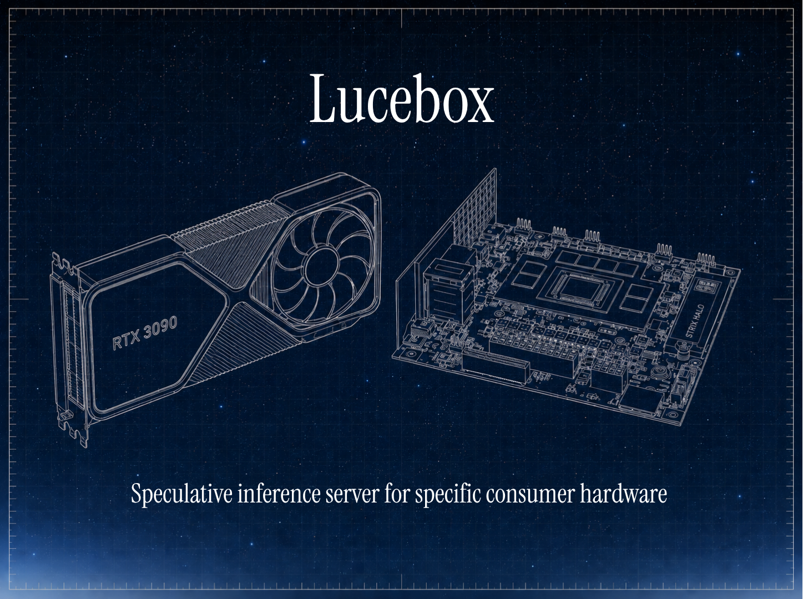

<p align="center">
  
</p>

<p align="center">
  <a href="README.md">English</a> · <strong>简体中文</strong>
</p>

<p align="center">
  <a href="https://lucebox.com"></a>
  <a href="https://huggingface.co/Lucebox"></a>
  <a href="https://discord.gg/yHfswqZmJQ"></a>
  <a href="https://lucebox.com/blog"></a>
</p>

<p align="center">
  <a href="LICENSE"></a>
  <a href="https://developer.nvidia.com/cuda-toolkit"></a>
  <a href="https://rocm.docs.amd.com/projects/HIP/en/latest/"></a>
  <a href="https://isocpp.org"></a>
</p>

<p align="center">
  <strong>为速度而生的本地大模型推理服务器。自定义内核、投机预填充与投机解码。</strong><br/>
  引擎中的每一项优化都面向特定的模型家族与硬件平台。
</p>

---

## 项目简介

Lucebox 是一个专注于本地 LLM 推理加速的开源服务器项目。它通过针对特定模型家族和消费级硬件定制 CUDA/HIP 内核，叠加投机预填充（Speculative Prefill）与投机解码（Speculative Decoding）等技术，在不牺牲精度的前提下将本地推理吞吐提升 3-10 倍。

核心理念：本地 AI 应成为默认选项，而非特权——私有数据、无按 token 计费、无厂商锁定。

---

## 推理引擎优化

每项优化自成模块，附带安装说明与基准测试数据。

| 优化模块 | 说明 |
|---------|------|
| [**Megakernel**](optimizations/megakernel/) | 将 24 层融合为单个持久 CUDA 调度，Qwen 3.5-0.8B 上实现 413 tok/s 解码 |
| [**DFlash 27B**](server/) | 投机解码，Qwen 3.6-27B + DFlash 草稿模型，最高 4.84× 加速 |
| [**PFlash**](optimizations/pflash/) | 投机预填充，超长 prompt 压缩，最高 10.4× 加速 |
| [**Luce Spark**](optimizations/spark/) | MoE 专家卸载，让专家层不进显存也能保持近满速解码 |
| [**Luce KVFlash**](optimizations/kvflash/) | 分页 KV 缓存，解码速度不再依赖上下文长度 |

---

## 支持的模型与草稿器

所有加速数据均对比 vendored llama.cpp（`-fa 1`，相同 KV 量化）。草稿模型发布于 [huggingface.co/Lucebox](https://huggingface.co/Lucebox)。

| 模型 | 加速倍率 |
|-------|:-------:|
| Qwen 3.5-0.8B（Megakernel） | **~2×** |
| Qwen 3.6-27B + PFlash | **~5.6×** |
| Qwen 3.6-27B + DDTree | **4.84×** |
| Laguna-XS-2.1 33B + PFlash | **8.2×** @256K |
| Laguna-XS-2.1 33B + DFlash | **1.7×** @256K |
| Qwen 3.6-27B HIP | **~2.6×** |
| Gemma-4-26B-A4B | **1.31×** |

---

## 已测试硬件（GPU / APU）

基准参考平台：**RTX 3090（Ampere sm_86）**。其他 NVIDIA 架构由 CMake / `setup.py` 自动检测；AMD HIP 后端独立支持。

| 架构 | GPU | 最低 CUDA/ROCm | 状态 | 基准 |
|:---:|------|-----|:---------------:|------|:-----:|
| Ampere `sm_86` | RTX 3090、A 系列 | CUDA 12.0 | ✅ 参考平台 | [megakernel](optimizations/megakernel/RESULTS.md) · [dflash](server/RESULTS.md) |
| Blackwell `sm_120` | RTX 5090 | CUDA 12.8 | ✅ 205 tok/s，4.84× | [↗](server/RESULTS.md) |
| Blackwell `sm_121` | DGX Spark / GB10 | CUDA 12.9 | ✅ megakernel NVFP4 | [↗](optimizations/megakernel/RESULTS.md) |
| Turing `sm_75` | RTX 2080 Ti | CUDA 12.0 | ✅ 53 tok/s DFlash | [↗](server/RESULTS.md) |
| Ada `sm_89` | RTX 40 系列 | CUDA 12.0 | 🟡 社区 WSL2 测试 | [↗](server/RESULTS.md) |
| Blackwell `sm_110` | Jetson AGX Thor | CUDA 13.0 | 🟡 可编译，未测 | — |
| Volta `sm_70` / Pascal `sm_61` | V100、P40 | CUDA 12.0 | 🟡 回退路径，未测 | — |
| RDNA3.5 `gfx1151` | Ryzen AI MAX+ 395 | ROCm 6+ | ✅ 37 tok/s HIP | [↗](server/README.md) |
| RDNA3 `gfx1100` | Radeon RX 7900 XTX | ROCm 6+ | ✅ 50 tok/s HIP | [↗](server/README.md) |
| RDNA4 `gfx1201` | Radeon AI PRO R9700 | ROCm 6.4+ | ✅ 55 tok/s HIP | [↗](server/README.md) |

---

## 快速开始

### 方式一：Docker（推荐，免编译）

预构建镜像跟踪 `main` 分支，无需 CUDA 工具链或编译。拉取镜像、挂载权重、启动即可。提供 OpenAI 兼容 API（`:8000`）。

```bash
# 1. 拉取对应 GPU 的镜像
docker pull ghcr.io/luce-org/lucebox-hub:cuda12   # NVIDIA
docker pull ghcr.io/luce-org/lucebox-hub:rocm     # AMD

# 2. 下载目标模型到 server/models/，DFlash 草稿模型到 server/models/draft/
hf download unsloth/Qwen3.6-27B-GGUF Qwen3.6-27B-Q4_K_M.gguf --local-dir server/models/
hf download Lucebox/Qwen3.6-27B-DFlash-GGUF dflash-draft-3.6-q4_k_m.gguf --local-dir server/models/draft/

# 3. 启动（NVIDIA）
docker run --rm --gpus all -p 8000:8080 \
  -v "$PWD/server/models:/opt/lucebox-hub/server/models" \
  ghcr.io/luce-org/lucebox-hub:cuda12

# 3. 启动（AMD）
docker run --rm --device /dev/kfd --device /dev/dri \
  --group-add video --group-add render --security-opt seccomp=unconfined \
  -p 8000:8080 -v "$PWD/server/models:/opt/lucebox-hub/server/models" \
  ghcr.io/luce-org/lucebox-hub:rocm
```

启动后访问 `:8000/v1/chat/completions`（OpenAI 兼容接口）。

### 方式二：源码编译启动

默认配置：Qwen 3.6-27B Q4_K_M 目标模型 + Lucebox Q4_K_M DFlash 草稿模型，DDTree budget=22，TQ3_0 KV 缓存，全注意力。HTTP 端口 `:8000`。

```bash
# 编译（CUDA 12+，CMake 3.18+）
git clone --recurse-submodules https://github.com/Luce-Org/lucebox-hub && cd lucebox-hub
cmake -B server/build -S server -DCMAKE_BUILD_TYPE=Release
cmake --build server/build --target dflash_server -j

# 下载权重（约 18 GB）
hf download unsloth/Qwen3.6-27B-GGUF Qwen3.6-27B-Q4_K_M.gguf --local-dir server/models/
hf download Lucebox/Qwen3.6-27B-DFlash-GGUF dflash-draft-3.6-q4_k_m.gguf --local-dir server/models/draft/

# 运行（TQ3_0 KV 自动启用；设为 0 可关闭）
DFLASH27B_KV_TQ3=1 \
./server/build/dflash_server server/models/Qwen3.6-27B-Q4_K_M.gguf \
  --draft server/models/draft/dflash-draft-3.6-q4_k_m.gguf \
  --ddtree --ddtree-budget 22 --port 8000
```

### 发送请求

```bash
curl :8000/v1/chat/completions -H 'Content-Type: application/json' -d '{
  "model": "dflash",
  "messages": [{"role": "user", "content": "用 Python 写一个快速排序。"}],
  "temperature": 0
}'
```

> 提示：`temperature: 0`（贪心解码）可获得最高投机解码接受率和最快响应。

---

## Windows 原生编译

Windows 原生（MSVC）编译现已支持。详见 [PR #537](https://github.com/Luce-Org/lucebox/pull/537)。

**环境要求：** MSVC 2022、CUDA 12+、CMake 3.18+、Ninja

```powershell
# 配置（按需指定 GPU 架构，多个架构用分号分隔）
cmake -B server/build -S server -G Ninja -DCMAKE_BUILD_TYPE=Release `
  -DCMAKE_CUDA_ARCHITECTURES="75;80;86;89;90;100;110;120;121" `
  -DCMAKE_C_COMPILER=cl.exe -DCMAKE_CXX_COMPILER=cl.exe `
  -DDFLASH27B_TESTS=OFF -DDFLASH27B_ENABLE_BSA=OFF

# 编译
cmake --build server/build --target dflash_server -j
```

支持的 GPU 架构：`sm_75`（20 系）、`sm_80`（A100）、`sm_86`（30 系）、`sm_89`（40 系）、`sm_90`（H100）、`sm_100/110`（Blackwell）、`sm_120/121`（50 系 / GB10）。

---

## 客户端工具

[`harness/`](harness/) 提供在 Claude Code、Codex、OpenCode、Hermes、Pi、OpenClaw、Open WebUI 等客户端中运行 Lucebox 的启动脚本与回归测试。

```bash
# 在 Codex 中运行 Lucebox
DFLASH_SERVER_BIN=server/build/dflash_server \
DFLASH_TARGET=server/models/Qwen3.6-27B-Q4_K_M.gguf \
DFLASH_DRAFT=server/models/draft/dflash-draft-3.6-q4_k_m.gguf \
MAX_CTX=32768 BUDGET=22 VERIFY_MODE=ddtree \
harness/clients/run_codex.sh
```

---

## 项目存在的意义

现有的通用推理框架（llama.cpp、PyTorch 等）追求“一套代码在所有硬件上都还行”，但无法在任何单一硬件上做到极致。消费级显卡在运行 27B 模型时，往往只能发挥出 1/4 到 1/6 的真实吞吐。

Lucebox 通过针对特定芯片定制内核——投机解码、投机预填充、融合 megakernel、校准式 MoE 专家卸载——将闲置的硅片算力转化为 3-10× 的加速。这些优化原本锁定在数据中心 GPU 的 BF16 权重上，本项目将它们带到消费级显卡。

---

## 社区

- **Discord**：[discord.gg/yHfswqZmJQ](https://discord.gg/yHfswqZmJQ)
- **官网**：[lucebox.com](https://lucebox.com)
- **Issues**：[github.com/Luce-Org/lucebox-hub/issues](https://github.com/Luce-Org/lucebox-hub/issues)
- **博客**：[lucebox.com/blog](https://lucebox.com/blog)

> **完整服务器参数文档请参阅 [英文 README](README.md)。**

---

<p align="center">
  <sub><a href="LICENSE">Apache 2.0</a> · <a href="https://lucebox.com">Lucebox.com</a></sub>
</p>
